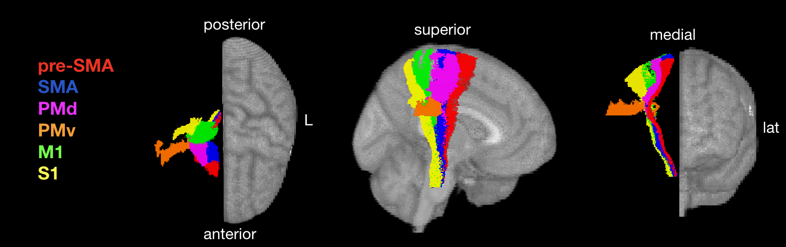

This repository contains code to predict chronic motor scores from lesion data.

# Contents

1. [Predicting motor scores from M1-CST-LL](#m1-lesion-load)
2. [Predicting motor scores from CST-LL (6 tracts)](#6-tract-smatt-cst-lesion-load)
3. [Predicting motor scores from estimated structural disconnection](#estimate-structural-disconnection)

# M1 lesion load
Calculate the lesion load on the corticospinal tract originating from ipsilesional M1. 

# 6-tract SMATT CST lesion load

Calcualte the lesion load on all ipsilesional corticospinal tracts originating from M1 (primary motor cortex), S1 (sensorimotor cortex), SMA (supplementary motor area), pre-SMA (pre-supplementary motor area), ventral premotor cortex (PMv), and dorsal premotor cortex (PMd)

Template: [Sensorimotor Area Tract Template (SMATT)](http://lrnlab.org/) 

Code:

- MATLAB: SMATT_lesion_load.m (requires FSL)
- python: SMATT_lesion_load.ipynb

-- requires FSL, but any nifti read function is fine

# Estimate structural disconnection
The Network Modification Tool [NeMo 2.1](https://github.com/kjamison/nemo) can be used to estimate regional or pairwise change in connectivity (ChaCo) scores, given a binary lesion mask.

