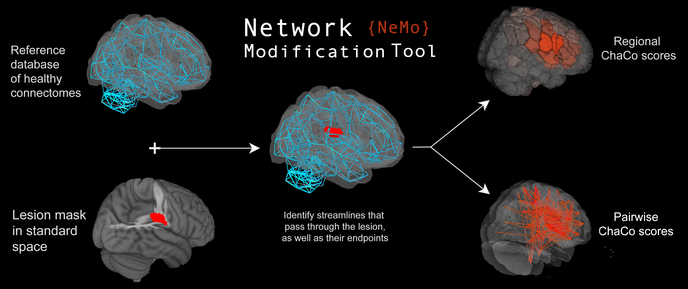

Predict chronic motor scores from structural network disruption.

# Contents
1. [Estimating structural disconnection](#estimate-structural-disconnection)

# Estimate structural disconnection.
The Network Modification Tool [NeMo 2.1](https://github.com/kjamison/nemo) can be used to estimate regional or pairwise change in connectivity (ChaCo) scores, given a binary lesion mask.

