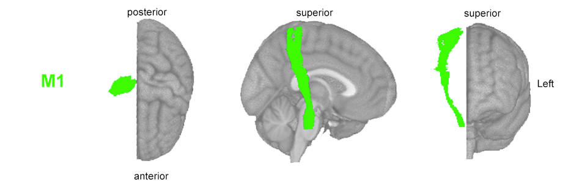
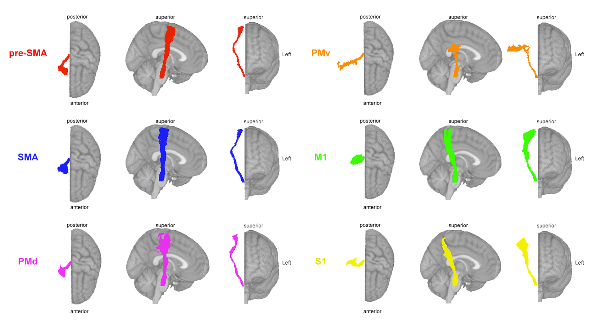
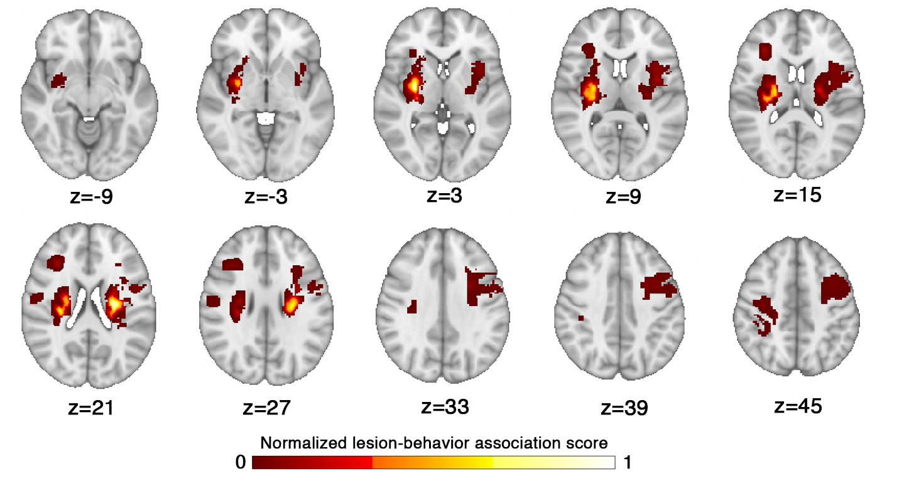
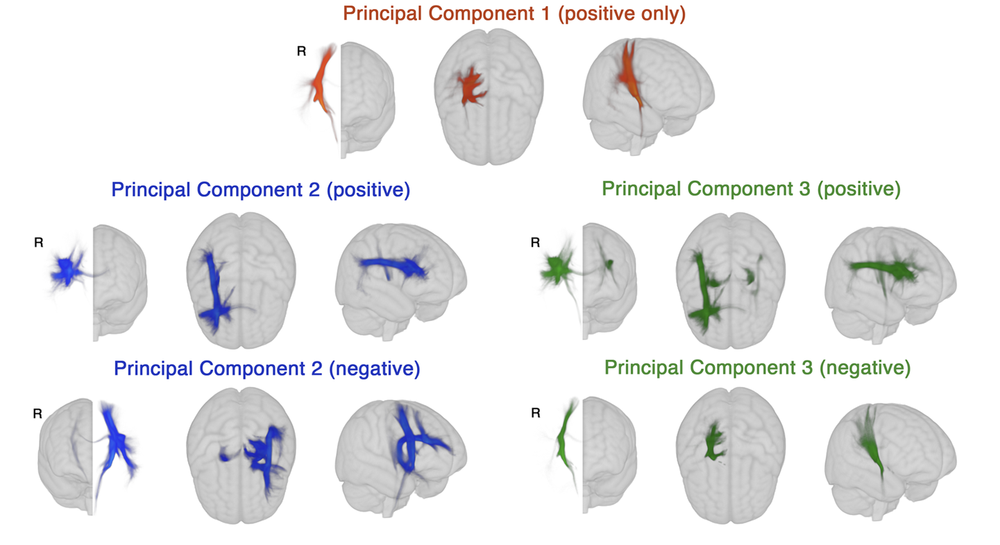
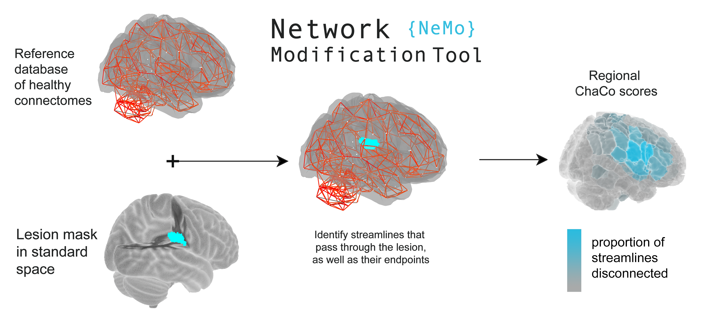

# Prediction of post-stroke behavioural scores from lesion data
This repository contains code and data that can be used to train and evaluate predictive models of post-stroke outcome from volumetric lesion 
data. 

It is based on the paper by Olafson and colleagues, 'Data-driven biomarkers outperform theory-based biomarkers in predicting stroke motor 
outcomes' (2023).

## Getting Started
The machine learning pipeline, which includes python code for data formatting and model evaluation, can be found in [pipeline](pipeline). It uses 
the sklearn package, and is meant to be relatively easily adaptable to new data.

# Contents

1. [Predicting motor scores from M1-LL](#m1-corticospinal-tract-lesion-load)
2. [Predicting motor scores from SMATT-LL](#sensorimotor-area-tract-template-smatt-lesion-load)
3. [Predicting motor scores from LBM-LL](#lesion-behaviour-map-lesion-load) 
4. [Predicting motor scores from sLNM-LL](#structural-lesion-network-map-lesion-load)
5. [Predicting motor scores from ChaCo scores](#change-in-connectivity-chaco-scores)

# M1 corticospinal tract lesion load

Calculate the lesion load on the corticospinal tract originating from ipsilesional M1. 
Template: [Sensorimotor Area Tract Template (SMATT)](http://lrnlab.org/)
Calculated as the number of lesioned voxels that intersect with the ipsilesional M1-CST (see code fro SMATT lesion load).

# Sensorimotor Area Tract Template (SMATT) lesion load

Calcualte the lesion load on all ipsilesional corticospinal tracts originating from M1 (primary motor cortex), S1 (sensorimotor cortex), SMA (supplementary motor area), pre-SMA (pre-supplementary motor area), ventral premotor cortex (PMv), and dorsal premotor cortex (PMd).
Calculated as the proportion of lesioned voxels that intersect with each ipsilesional tract.
Template: [Sensorimotor Area Tract Template (SMATT)](http://lrnlab.org/) 

Code to calculate SMATT-LL from lesion data can be found [here](data_processing/SMATT_lesion_load.ipynb).

# Lesion Behaviour Map lesion load

This map was generated by [Bowren et al. 2022](https://pubmed.ncbi.nlm.nih.gov/35025994/), who used sparse canonical correlation 
analysis to produce maps of voxels in which damage was associated with Fugl-Meyer scores. Lesion load to this lesion-behaviour map (LBM-LL) was calculated as the sum of voxels 
in the LBM that intersect with the lesion. 

The map can be found [here](pipeline/extras/).

If you use this map, please cite the appropriate source:
> Bowren, M., Bruss, J., Manzel, K., Edwards, D., Liu, C., Corbetta, M., Tranel, D., & Boes, A. D. (2022). Post-stroke outcomes 
predicted from multivariate lesion-behaviour and lesion network mapping. Brain: A Journal of Neurology. 
https://doi.org/10.1093/brain/awac010

Code to calculate LBM-LL from lesion data can be found [here](data_processing/LBM_lesion_load.ipynb).

# Structural lesion network map lesion load

These maps were generated by [Bowren et al., 2022](https://pubmed.ncbi.nlm.nih.gov/35025994/), who identified peak white matter (WM) voxels from 
lesion-behaviour maps (described above). Then, tractography was seeded from these peak WM voxels to identify associated structural networks, called structural lesion network maps (sLNMs). Principal 
components analysis of sLNMs was performed, which produced 3 principal components that correspond to 5 sLNM maps (PC1, and positive/negative 
weights of PC2 and PC3). Lesion load on each sLNM map was calculated for each subject as the sum of the voxel intensities from the principal 
component map that intersected the lesion mask.

The maps can be found [here](pipeline/extras/).

If you use these maps, please cite the appropriate source:
> Bowren, M., Bruss, J., Manzel, K., Edwards, D., Liu, C., Corbetta, M., Tranel, D., & Boes, A. D. (2022). Post-stroke outcomes
predicted from multivariate lesion-behaviour and lesion network mapping. Brain: A Journal of Neurology.
https://doi.org/10.1093/brain/awac010

# Change in Connectivity (ChaCo) scores

The Network Modification Tool [NeMo 2.1](https://kuceyeski-wcm-web.s3.us-east-1.amazonaws.com/upload.html) can be used to estimate regional or pairwise change in connectivity (ChaCo) scores, given a binary lesion mask.

Lesion masks (or .zip files containing lesion masks) can be converted into ChaCo scores using our [online portal](https://kuceyeski-wcm-web.s3.us-east-1.amazonaws.com/upload.html). For more information 
about the Network Modification tool, see the dedicated [GitHub documentation page](https://github.com/kjamison/nemo#readme).
