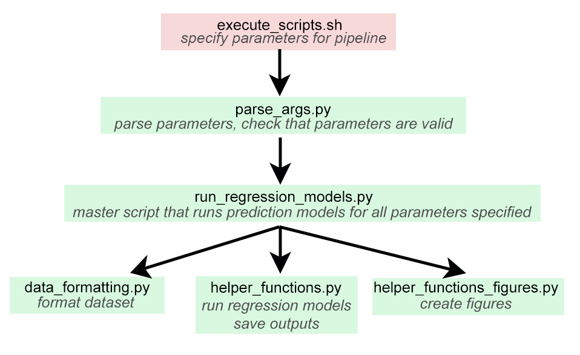

## Some assumptions of the pipeline:

- Subject IDs correspond to NeMo output file names (if using ChaCo scores to predict outcomes)
- Your data is stored in a .csv file that contains subjects in rows, with at least 2 named columns:
 
1) subject IDs (e.g. subid_colname: BIDS_ID)
2) A singular outcome variable (e.g. y_var: normed_motor_scores)

and optionally,

3) covariates of interest (e.g. sex, age)
4) lesion load values (if using M1-LL, SMATT-LL, LBM-LL, or sLNM-LL)
5) chronicity (e.g. acute, chronic) if specifying a subset of the data

Custom column names can be specified the pipeline according to the documentation below.

The information entered into parse_args.py will be used to save results into files, producing prefixes according to the structure:

```
fileprefix = {atlas}_{y_var}_{chaco_type}_{subset}_{model_specified}_crossval{crossval_type}_{n}_
```
where n is the permutation #.
e.g.,

```
shen268_normed_motor_scores_chacovol_chronic_ridge_crossval1_perm0_
```
would be the prefix using the atlas "shen268", where y_var is "normed_motor_scores", chaco_types is "chacovol", the chronicity subset specified is "chronic", model_specified is "ridge", crossval_type is "1" (see below for more details)


## Documentation of inputs
```
usage: parse_args.py [-h] [--nemo_path NEMO_PATH] [--nemo_settings NEMO_SETTINGS] [--yvar_colname YVAR_COLNAME] [--subid_colname SUBID_COLNAME] [--site_colname SITE_COLNAME] [--chronicity_colname CHRONICITY_COLNAME] [--csv_path CSV_PATH] [--y_var Y_VAR] [--subsets SUBSETS] [--models_tested MODELS_TESTED]
                     [--verbose VERBOSE] [--generate_figures GENERATE_FIGURES] [--covariates COVARIATES] [--lesionload_types LESIONLOAD_TYPES] [--nperms NPERMS] [--save_models SAVE_MODELS] [--ensembles ENSEMBLES] [--atlases ATLASES] [--chaco_types CHACO_TYPES] [--crossval_types CROSSVAL_TYPES] [--null NULL]
                     [--results_path RESULTS_PATH] [--output_folder OUTPUT_FOLDER] [--figs_only FIGS_ONLY] [--fig_path FIG_PATH] [--workbench_vis WORKBENCH_VIS] [--scenesdir SCENESDIR] [--hcp_dir HCP_DIR] [--wbpath WBPATH] [--boxplots BOXPLOTS] [--ensemble_atlas ENSEMBLE_ATLAS]
                     [--override_rerunmodels OVERRIDE_RERUNMODELS] [--final_model FINAL_MODEL]

Set up and run machine learning pipeline for lesion biomarker data.

optional arguments:
  -h, --help            show this help message and exit
  --nemo_path NEMO_PATH
                        Absolute path where NeMo outputs (subjectID_*_mean.pkl files) are located, default='/home/ubuntu/enigma/lesionmasks/', where * is NeMo-generated suffix
  --nemo_settings NEMO_SETTINGS
                        Settings used in Network Modification Tool (used to access output files). Default=['1mm','sdstream'], Options: '1mm', '2mm', 'sdstream', 'ifod2act'. Must have resolution 1st and then deterministic/probabilistic choice second.
  --yvar_colname YVAR_COLNAME
                        Column name of outcome scores (to be predicted) in .csv file, default='NORMED_MOTOR'
  --subid_colname SUBID_COLNAME
                        Column name of subject IDs in .csv file, default='BIDS_ID'
  --site_colname SITE_COLNAME
                        Column name of the sites variable in .csv file. If subjects are all from the same site, specify 'none' (default). Options: 'site', 'none', 'SITE', etc. default='none'
  --chronicity_colname CHRONICITY_COLNAME
                        Column name of chronicity variable in .csv file. Chronic subjects should have a value of 180, acute subjects should have value 90. If subjects are all of one type, specify 'none' (default). Default='none'
  --csv_path CSV_PATH   Absolute path where .csv file containing demographic/outcome scores is stored, default='/home/ubuntu/enigma/Behaviour_Information_ALL_April7_2022_sorted_CST_12_ll_slnm.csv'
  --y_var Y_VAR         Dependent variable in regression models (column name in .csv), default='normed_motor_scores'
  --subsets SUBSETS     Subset of data to use for analysis, options: 'acute', 'chronic', 'chronic', 'none' default=['chronic']. 'acutechronic' is used to enhance the traning data (but not test data) with acute subjects.
  --models_tested MODELS_TESTED
                        Machine learning model used for ChaCo score-based prediction. Note that models for lesion load predictions are hard-coded. If running only lesion-load based predictions, specify ['none'], Default='none'
  --verbose VERBOSE     Whether to print out verbose output, default=True
  --generate_figures GENERATE_FIGURES
                        Whether to make figures/boxplots, default=False
  --covariates COVARIATES
                        Covariates to include in model, default=[]
  --lesionload_types LESIONLOAD_TYPES
                        Lesion load types to use, Options, ['none', 'M1', 'all', 'all_2h'], default=['none]
  --nperms NPERMS       Number of permutations to run, default=1
  --save_models SAVE_MODELS
                        Whether to save trained models, default=True
  --ensembles ENSEMBLES
                        What ensemble to run. Options: 'demog', 'none', 'chaco_ll', 'chaco_ll_demog', default=['none']
  --atlases ATLASES     Which atlas to use, 'none', 'fs86subj', 'shen268', default=['fs86subj']
  --chaco_types CHACO_TYPES
                        Regional or pairwise chaco type, Options: 'none', 'chacovol', 'chacoconn', default=['none']
  --crossval_types CROSSVAL_TYPES
                        Which cross-validation scheme to use, Options = ['1', '2', '3', '4', '6'], default=['1']
  --null NULL           Value to use for null entries in data, default=-1 (no null model)
  --results_path RESULTS_PATH
                        Absolute path to save results (model outputs in .npy format), default='/home/ubuntu/enigma/results'
  --output_folder OUTPUT_FOLDER
                        Directory below results_path to save outputs, for multiple analyses, default='/analysis_1'
  --figs_only FIGS_ONLY
                        Whether to only save figures, without running models, default=False
  --fig_path FIG_PATH   Saves figures to this directory, default='fig_path'
  --workbench_vis WORKBENCH_VIS
                        Whether to generate visualizations using Workbench, default=False
  --scenesdir SCENESDIR
                        If generating Workbench visualizations: directory where Workbench scenes are saved and where atlas parcellation files are stored, default='/home/ubuntu/enigma/motor_predictions/wb_files'
  --hcp_dir HCP_DIR     If generating Workbench visualizations: directory where HCP defaults are stored (i.e. midthickness gii files), default='/home/ubuntu/enigma/motor_predictions/wb_files/HCP_S1200_GroupAvg_v1'
  --wbpath WBPATH       If generating Workbench visualizations: path to Workbench command-line interface, default='/home/ubuntu/enigma/motor_predictions/wb_files/workbench/bin_linux64'
  --boxplots BOXPLOTS   Whether to generate boxplots of results, default=False
  --ensemble_atlas ENSEMBLE_ATLAS
                        Which ChaCo atlas to use, if running ensemble models with lesion data + ChaCo scores, options 'none','fs86subj', 'shen268', default='fs86subj
  --override_rerunmodels OVERRIDE_RERUNMODELS
                        Whether to re-run models even if already run with same parameters, default=False
  --final_model FINAL_MODEL
                        Run a single 5-fold cross-validation and return the final model with its selected features.
```


## *Cross-validation types:

1) Outer CV: Random partition fixed fold sizes, Inner CV: Random partition fixed fold sizes')
2) Outer CV: Leave-one-site-out, Inner CV: Random partition fixed fold sizes')
3) Outer CV: Group K-fold, Inner CV: Group K-fold')
4) Outer CV: GroupShuffleSplit, Inner CV:  Random partition fixed fold sizes')
5) Outer CV: GroupShuffleSplit, Inner CV:  GroupShuffleSplit')


## Outputs:

### Basic outputs you may care about:

- {fileprefix}_scores.py
-- R^2 scores for all test folds in the outer loop
- {fileprefix}_correlations.npy
-- Correlations between true & predicted outcomes for all test folds in outer loop
- {fileprefix}_beta_coeffs.npy
-- Beta coefficients for features
- {fileprefix}_model.py 
-- The final trained model for all training folds
- {fileprefix}_test_group_sizes.py 
-- Size of subjects in test folds.

Files are saved as .npy pickled objects in the folder results_path/output_path 

See basic_model_M1_CST_LL.sh, basic_model_ChaCo.sh for examples of how to call parse_args.py and run the model.

